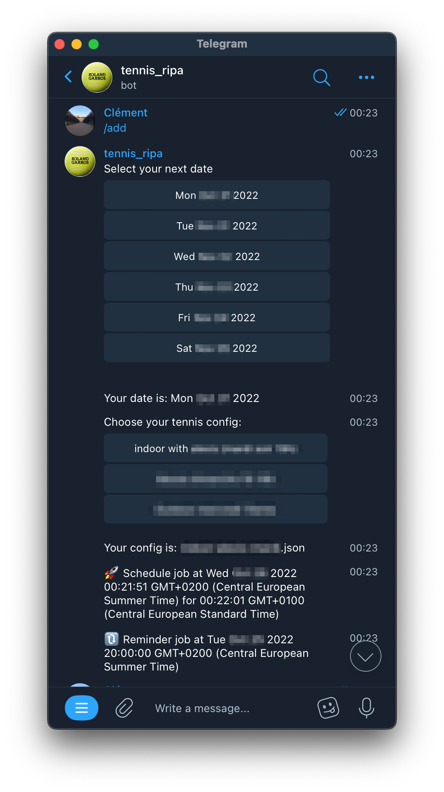
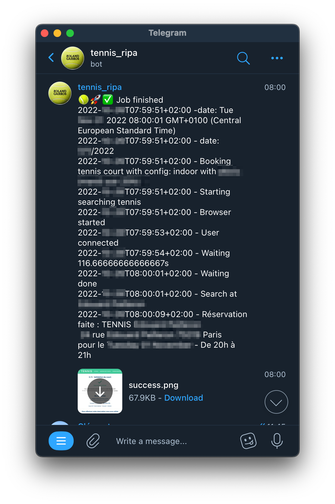
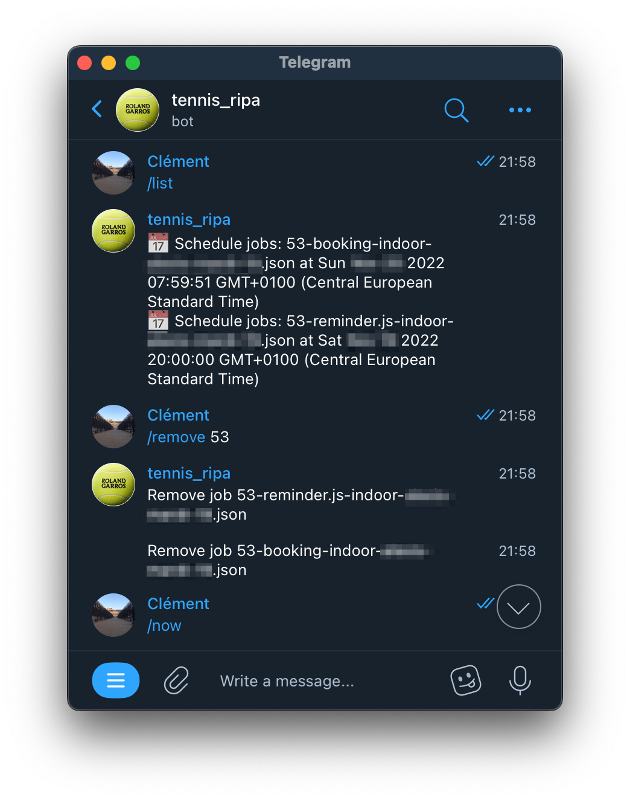
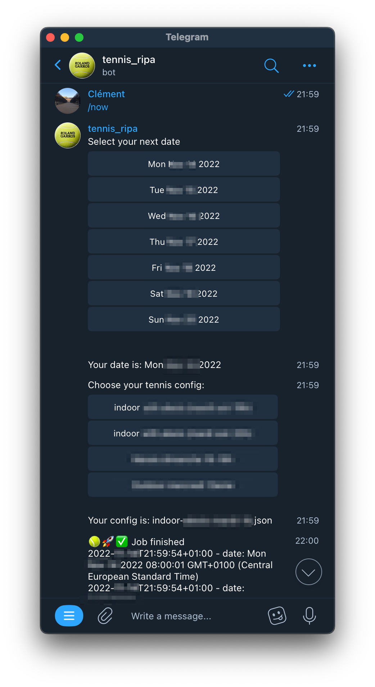

#  tennis-ripa

Paris tennis ( https://tennis.paris.fr) automation (no longer works because of the implementation of CAPTCHA )

I created a telegram bot based on the code of https://github.com/bertrandda/par-ici-tennis, it wraps the chrome less script but allows to schedule it easily with presets of configs.

# Screenshots

## Command: /add

Add new reservation (scheduled)

## Scheduled job result

## Command: /list

List all reservations

## Command: /now

Schedule a reservation now

